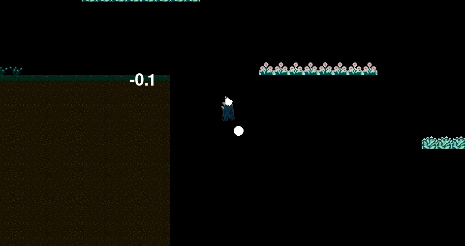

# the-friends-game
> “The only way to have a friend is to be one.” — Ralph Waldo Emerson

A lonely gremlin disguised as a dark knight with a headtorch for light is chillingly wondering in a dark space looking for friends. For his walk 1.0 he had borrowed time and chose to go right, just to discover that the righ path leads him to a gravity fall into the space. Some good luck has this gremlin - he discovers a path full of beautiful plants, and some sweet smelling rose flowers. He wants to give up on his walk. He is not a fan of this path. But, only the creator knows, that if the gremling stays strong and keeps going, he will discover a treasure at the end of the path that will give him some strenght to carry on walking in a dark lonely space, in his endless search for new friends. To be continued at version 2.0

## Game screenshot


## Features
* Feature 1: Sound and graphics
* Feature 2: Movement keys A and D, gravity

## Getting Started
Follow the below steps to configure your local environment to run the game

### Prerequisites
Install the following on your machine:
• Python from 3.7 up to Python 3.13 (Pygame library officially supports ony these versions, and does not support Python 3.14, yet)
• pip (Python package installer)

### Installation 
1. Clone the repository:
```
git clone https://github.com/SiI3nt/the-friends-game.git
cd the-friends-game
```
2. Create and activate a virtual environment:
```
# Windows
python -m venv venv
.\venv\Scripts\activate

# macOS/Linux
python3 -m venv venv
source venv/bin/activate
```
3. Install the dependencies:
```
pip install -r requirements.txt
```

### Running the Game
To run the game:
```
python main.py
```

### How to Play
Controls
* A, D Keys: Move your character 
Objective
* Walk in space. When the game runs, press the D key and keep pressing until find a treasure


### Tech Stack
* Core Language: Python


### License
To be finalised
